# Smart Robot Car
An advanced autonomous obstacle-avoidance robot with high-frequency radar scanning, adaptive speed control, and PID-based motion stability.

## Overview

This project implements a complete intelligent navigation system for a small autonomous robot. The main control algorithm in `Genius_design/Genius_design.ino` enables the robot to:

1. **Real-time Heading Stabilization** – Uses MPU6050 gyroscope with PID control to maintain straight-line motion
2. **High-Frequency Radar Scanning** – Non-blocking servo-based ultrasonic scanning at three angles (35°, 90°, 145°)
3. **Adaptive Acceleration Control** – Smooth speed ramping prevents jerky motion and improves stability
4. **Intelligent Obstacle Avoidance** – 360° environment scanning to identify optimal escape routes
5. **Timeout-Based Recovery** – Detects stuck conditions and auto-reverses to prevent deadlocks

## Key Features

### Motion Control
- **PID-Based Straight-Line Driving** – Gyroscope feedback maintains precise heading while accounting for motor/surface variations
- **Adaptive Speed Management** – Distance-based speed adjustment with smooth acceleration/deceleration limits
- **Lateral Avoidance** – Side wall detection triggers smooth heading corrections to maintain center position

### Obstacle Detection & Response
- **Front Safety Threshold (15 cm)** – Emergency brake triggered when obstacle detected ahead
- **Side Safety Threshold (5 cm)** – Emergency stop to prevent wall collisions
- **Warning Distance (35 cm)** – Preemptive lateral avoidance before reaching critical distance

### Turning & Recovery
- **Precise Angular Rotation** – PID-controlled turning with configurable speed limits
- **2-Second Timeout Protection** – Automatic reverse-and-escape if stuck during rotation
- **Post-Obstacle Reinitialization** – Sensor recalibration after obstacle escape to resume smooth motion

## Hardware Requirements

- **Motor Driver** – TB6612 dual-motor driver (or similar H-bridge)
- **Motors** – 2× DC motors with PWM control capability
- **Sensor Suite:**
  - MPU6050 6-DOF gyroscope/accelerometer (I²C bus)
  - HC-SR04 ultrasonic rangefinder (10-400 cm)
  - SG90 servo motor for radar scanning
- **Microcontroller** – Arduino-compatible board (Uno, Mega, etc.)
- **Power** – Battery supply for motors and sensors

## File Structure

| File | Purpose |
|------|---------|
| `Genius_design/Genius_design.ino` | Complete autonomous navigation system with all advanced features |
| `move_direction/move_direction.ino` | Basic PID straight-line control example (MPU6050 + motors) |
| `obstacle_move/obstacle_move.ino` | Simple obstacle avoidance with ultrasonic detection |
| `ultrasound_scan/ultrasound_scan.ino` | Servo-based radar scanning utility |
| `baseline.ino` | Motor control foundation (reference implementation) |

## Pin Configuration

```
Motor Control (TB6612):
  PWMA (Right Motor)  → Pin 5 (PWM)
  PWMB (Left Motor)   → Pin 6 (PWM)
  AIN_1 (Right Dir)   → Pin 7
  BIN_1 (Left Dir)    → Pin 8
  STBY                → Pin 3

Sensors:
  Ultrasonic TRIG     → Pin 13
  Ultrasonic ECHO     → Pin 12
  Servo Signal        → Pin 10
  MPU6050 SDA         → A4
  MPU6050 SCL         → A5
```

## Control Algorithm Flow



## Demo Video

[](Track%20video.mp4)

<video width="640" height="480" controls>
  <source src="Track video.mp4" type="video/mp4">
  Your browser does not support the video tag. Please download the video manually.
</video>

The video demonstrates the robot's autonomous navigation capabilities in a real-world test environment, showcasing:
- Smooth straight-line motion with gyro stabilization
- Real-time obstacle detection and emergency braking
- Intelligent 360° scanning to find optimal escape routes
- Precise turning and recovery from obstacles
- Continuous mission resumption after avoidance maneuvers

## Configuration & Tuning

### Safety Parameters (distance in cm)

```cpp
SafeDistanceFront = 15   // Front obstacle emergency threshold
SafeDistanceSide = 5     // Side wall emergency threshold  
WarningDistance = 35     // Preemptive lateral avoidance trigger
MAX_DISTANCE = 60        // Sensor max range
```

### Motion Control Parameters

```cpp
// Straight-line PID
straight_Kp = 15.0      // Gyro heading correction coefficient

// Speed adaptation
speed_Kp = 4.5          // Distance-to-speed conversion gain
speed_Kd = 0.5          // Speed derivative dampening
AccelRate = 100.0       // PWM increase limit per second
MaxSpeed = 220          // Maximum motor PWM value
MinForwardSpeed = 80    // Minimum speed threshold

// Turning control
turn_Kp = 4.0           // Angle error gain
turn_Ki = 0.05          // Cumulative error integral
turn_Kd = 0.2           // Angular velocity dampening
minTurnSpeed = 150      // Minimum turning speed (overcome friction)
maxTurnSpeed = 220      // Maximum turning speed
```

### Tuning Guide

1. **For Straight-Line Improvement** – Increase `straight_Kp` if drifting, decrease if oscillating
2. **For Smoother Acceleration** – Lower `AccelRate` for gentler ramping (default: smooth for most platforms)
3. **For Better Obstacle Avoidance** – Adjust `WarningDistance` based on your test environment
4. **For Tighter Turns** – Increase `turn_Kp` or `minTurnSpeed` if turning radius is too wide
5. **For Faster Response** – Decrease `scanInterval` (default 120 ms) for more frequent sensor updates

## Quick Start

1. **Hardware Assembly**
   - Mount motors, servo, ultrasonic sensor, and MPU6050 on robot chassis
   - Connect wiring per "Pin Configuration" section above
   - Ensure motor polarity is correct (both wheels forward with same direction pin)

2. **Software Setup**
   - Install Arduino IDE and required libraries:
     ```
     MPU6050 library (by ElectronicCats or InvenSense)
     Servo library (built-in)
     Wire library (built-in)
     ```
   - Open `Genius_design/Genius_design.ino` in Arduino IDE
   - Verify board selection and COM port
   - Upload sketch to microcontroller

3. **Testing**
   - Place robot in open area with minimum 1 meter clearance in all directions
   - Power on and observe initial alignment sequence
   - Verify straight-line motion, obstacle detection, and turning behavior
   - Adjust tuning parameters as needed for your specific hardware

## Troubleshooting

| Issue | Likely Cause | Solution |
|-------|-------------|----------|
| Robot drifts left/right | Uneven motor performance or gyro bias | Increase `straight_Kp` or recalibrate MPU6050 |
| Jerky acceleration | `AccelRate` too high | Reduce parameter value to 50-80 |
| Overshoots obstacles | `WarningDistance` too large | Decrease to 25-30 cm |
| Stuck in corners | Turn speed insufficient | Increase `minTurnSpeed` to 180+ |
| Ultrasonic reads 400cm | Timeout or reflective surface | Reduce `WarningDistance` or check wiring |

## Performance Notes

- **Scan Rate**: 120 ms between consecutive distance measurements (~8 Hz)
- **Loop Frequency**: ~100 Hz main loop iteration
- **Response Time**: <200 ms from obstacle detection to full emergency brake
- **Turn Accuracy**: ±1.5° gyro tolerance during rotation
- **Battery Runtime**: Dependent on motor power and duty cycle (typically 30-60 minutes)

## Future Enhancement Ideas

- Add magnetic compass for absolute heading reference
- Implement path planning algorithm for point-to-point navigation  
- Add color/line-following capability with camera module
- Wireless remote control via Bluetooth/WiFi
- Performance logging to SD card for analysis
- Machine learning obstacle prediction

## Reference Documentation

- **MPU6050** – 6-DOF motion sensor with built-in DMP
- **HC-SR04** – Ultrasonic rangefinder (40 kHz carrier)
- **TB6612** – Dual motor driver with logic-level control
- **Arduino PWM** – 0-255 PWM value corresponds to 0-100% duty cycle

## License

This project is provided as-is for educational and personal robotics projects. Feel free to modify and redistribute.

## Contact & Support

For questions, issues, or improvements, please refer to the inline code comments and hardware documentation for your specific components.
